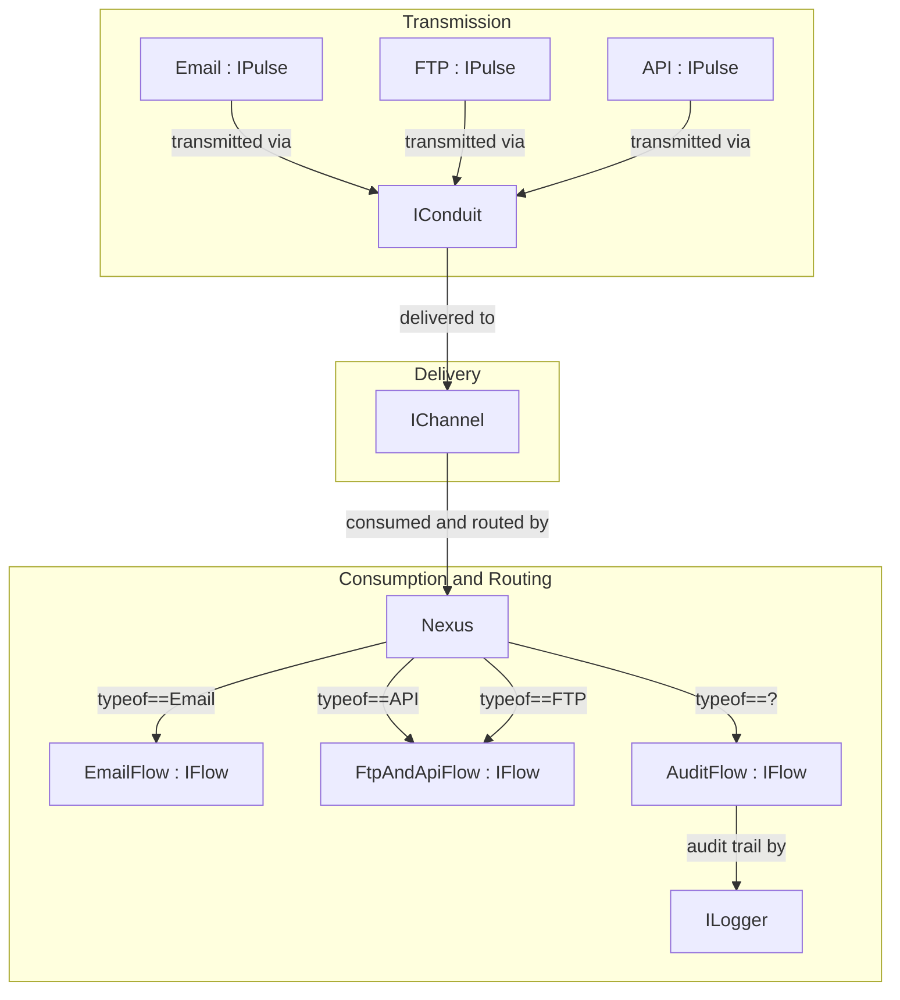
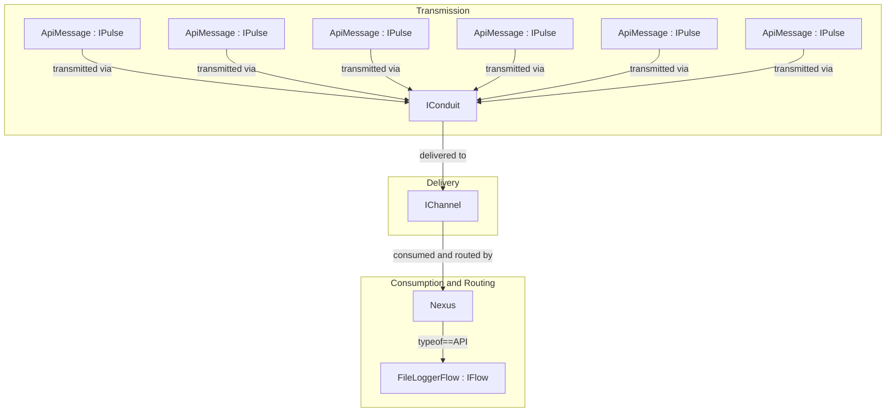
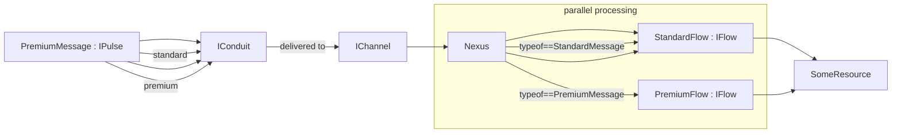
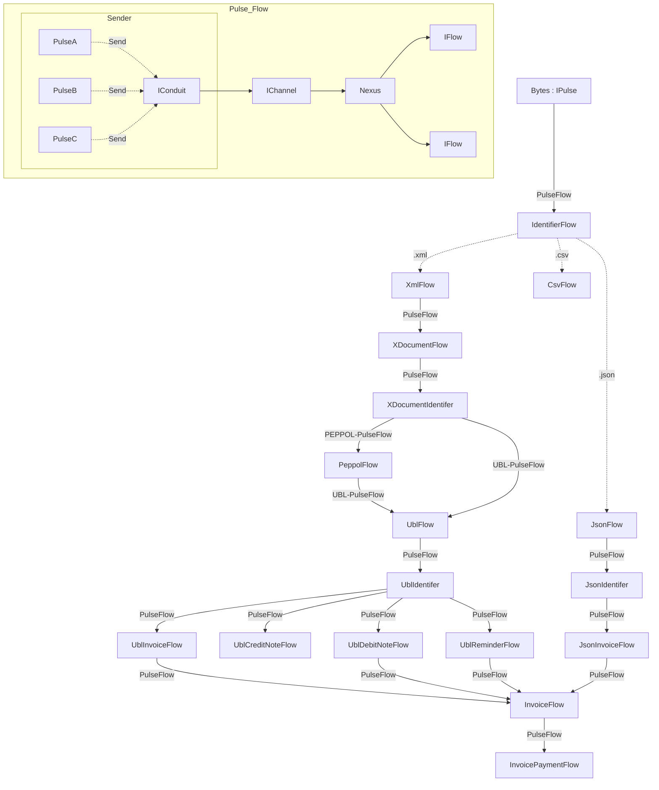

# PulseFlow (Local Messaging)

PulseFlow Local Messaging is a lightweight, high-performance messaging system that enables seamless communication, and thread-safe data transfer between different parts of an application. It's designed to be simple, flexible, and scalable, allowing for easy integration into any system architecture.

___
[](LICENSE)
[](https://www.nuget.org/packages/Frank.PulseFlow)
[](https://www.nuget.org/packages/Frank.PulseFlow)


___

## Table of Contents

- [Overview](#overview)
  - [Key Features](#key-features)
  - [Illustration](#illustration)
  - [Use Cases](#use-cases)
    - [Example 1 - Web API](#example-1---web-api)
    - [Example 2 - Priority Queue](#example-2---priority-queue)
    - [Example 3 - Complex Data Categorization](#example-3---complex-data-categorization)
- [Getting Started](#getting-started)
  - [Installation](#installation)
- [Concepts](#concepts)
  - [Nexus](#nexus)
  - [Conduit](#conduit)
  - [Pulse](#pulse)
  - [Flow](#flow)
___

## Acknowledgements

This is a very thin abstraction layer on top of [System.Threading.Channels](https://www.nuget.org/packages/System.Threading.Channels), which is a NuGet package that gets shipped along with every release of .NET. 
The reason for this abstraction layer is to make it easier to use `System.Threading.Channels` in a Dependency Injection scenario, and to make it easier to use `System.Threading.Channels` in a thread-safe manner.
Thanks to the .NET team for making `System.Threading.Channels`, and in particular [Stephen Toub](https://github.com/stephentoub) for his [blog post](https://devblogs.microsoft.com/dotnet/an-introduction-to-system-threading-channels/) on `System.Threading.Channels`, and as part of the rest of the team.

## Overview

PulseFlow Local Messaging is a lightweight, high-performance messaging system that enables seamless communication
between different parts of an application. It's designed to be simple, flexible, and scalable, allowing for easy
integration into any system architecture.

### Key Features

- **Lightweight**: PulseFlow is a lightweight messaging system, with a small footprint and minimal resource
  requirements.
- **High Performance**: It's designed for high performance and scalability, capable of handling a vast volume of
  messages simultaneously.
- **Asynchronous Communication**: PulseFlow supports asynchronous data flow, allowing for non-blocking and concurrent
  message transmissions.
- **Flexible and Adaptable**: It's flexible and adaptable, capable of handling various types of messages and adapting
  its processing logic based on the nature and requirements of each message.
- **Simple and Easy to Use**: PulseFlow is simple and easy to use, with a straightforward API and minimal configuration
  requirements. This is assuming Dependency Injection is used. If not, then it's a bit more complicated, and not supported at this time.
- **Thread-Safe**: It's thread-safe, ensuring that messages are processed in a safe and reliable manner.
- **Open Source**: PulseFlow is open-source, with the source code available on GitHub.
- **Cross-Platform**: It's cross-platform, supporting multiple operating systems and platforms.
- **Supports multiple consumers**: PulseFlow supports multiple consumers, thereby allowing for parallel processing of
  messages. This is particularly useful in scenarios where there's a need to save messages to some form of audit trail or log.

### Illustration



In this Mermaid diagram:
- **IPulse** is the interface for the Pulse.
- **IConduit** is the interface for the Conduit, which is the pathway through which messages are transmitted.
- **IChannel** is the interface for the Channel, which is a wrapper around the `System.Threading.Channels.Channel<T>` class, which is a thread-safe data structure for passing data between producers and consumers located in different threads.
- **Nexus** is the central processing service, which handles the pulse messages.
- **IFlow** is the interface for the a flow, which is the mechanism that handles/consumes the pulse messages.
- **ILogger** is the interface for the generic logger in dotnet.

When you include this in a GitHub Markdown file, GitHub will render the Mermaid diagram as a visual graph. Remember to remove the extra backticks (```) in the beginning and end when adding this to your README.

### Use Cases

PulseFlow is a general-purpose messaging system that can be used in a wide variety of applications. It's particularly
useful in scenarios where there's a need for asynchronous communication between different parts of the system.


#### Example 1 - Web API

A use case is when you need multiple threads to do some non-multiple-thread-safe work, like saving to a log-file. Example: You have a web API and you want to save a all requests' route, method and user to a log-file. You can use PulseFlow to do this in a thread-safe manner, because PulseFlow's `IConduit` and `IChannel` are thread-safe. You can have multiple threads saving to the same log-file, and PulseFlow will ensure that the log-file is not written to by multiple threads at the same time, and that the writing happens in the order the messages are received.



#### Example 2 - Priority Queue

Another use case is when you need to prioritize messages. You might have some user-input that needs to be processed, and you want to prioritize some messages over others. You can use PulseFlow to do this,whithout having to worry about thread-safety. You can have multiple threads processing the messages, and PulseFlow will ensure that the messages are processed in the order they are received. And so if you have a different type for each priority, you can have multiple threads processing each priority, 
and so when you have 10-15 "normal" messages, your single "premium" message will get processed at in its own thread.



#### Example 3 - Complex Data Categorization

If you have layered data, and you want to categorize the data based on some of the layers, you can use PulseFlow to do this. Suppesed you have a data ingest system and all you get is a byte-array, and what you want is to parse the bytes to data that could represent an invoice. This can be done in "classical" logic structures, but this can mean large if/else or switch statements, and this can be hard to maintain or change. With PulseFlow you can get a more modular structure, where each step is a separate 
class, and you can easily add new steps, or change the order of the steps, or even add parallel steps. And you can do this without having to worry about thread-safety unless you want to through access to some shared resource instead of using the `IFlow`s to pass data between the steps, e.g. if you write to a log-file from different steps. (This is not recommended, but it is possible. Correct way is to use `IFlow`s to pass data between steps, and then have a separate `IFlow` that writes to the log-file.)



## Getting Started

This section provides a quick guide on how to get started with PulseFlow Local Messaging.

### Installation

PulseFlow is available as a NuGet package, which can be installed using the following command:

```bash
dotnet add package Frank.PulseFlow
```

Once installed, you can start using PulseFlow by adding the following using statement to your code:

```csharp
using Frank.PulseFlow;
```

### Basic Usage

The following code snippet shows a basic example of how to use PulseFlow:

```csharp
public class Program
{
    public static async Task Main(string[] args)
    {
        IHostBuilder builder = Host.CreateDefaultBuilder();
        builder.ConfigureServices((context, services) =>
        {
            services.AddPulseFlow(messagingBuilder =>
            {
                messagingBuilder.AddFlow<TextPulseFlow>();
            });
            services.AddHostedService<TestingService>();
        });
        IHost app = builder.Build();
        await app.RunAsync();
    }
}

public class TextFlow : IFlow
{
    private readonly ILogger<TextFlow> _logger;
    public TextFlow(ILogger<TextFlow> logger) => _logger = logger;
    public async Task HandleAsync(IPulse message, CancellationToken cancellationToken)
    {
        if (message is TextPulse textMessage)
            _logger.LogInformation("Received text message: {Text}", textMessage.Text);
        await Task.CompletedTask;
    }
    public bool CanHandle(Type pulseType) => pulseType == typeof(TextPulse);
}

public class TestingService : BackgroundService
{
    private readonly IConduit _messenger;
    public TestingService(IConduit messenger) => _messenger = messenger;
    protected override async Task ExecuteAsync(CancellationToken stoppingToken)
    {
        await Task.Delay(2000, stoppingToken);
        while (!stoppingToken.IsCancellationRequested)
        {
            await _messenger.SendAsync(new TextPulse { Id = Guid.NewGuid(), Text = "Hello World" });
            await Task.Delay(1000, stoppingToken);
        }
    }
}

public class TextPulse : BasePulse
{
    public string Text { get; set; }
}
```

## Concepts

This section provides an in-depth explanation of the key concepts and components within the system: Nexus, Conduit,
Pulse, and PulseFlow. Understanding these concepts is crucial for grasping how the system operates and interacts with
data.

### Nexus

The **Nexus** is the central hub of our messaging system, analogous to a neural network's core. It serves as the primary
processing service, where all data messages, or 'Pulses', are received, interpreted, and routed to their respective
destinations.

- **Role**: Nexus acts as the orchestrator within the system, managing the flow of messages and ensuring that each one
  is processed according to predefined rules and logic.
- **Functionality**: It handles various tasks like message validation, transformation, and decision-making on how and
  where messages should be directed post-processing.
- **Scalability and Performance**: Designed for high performance and scalability, Nexus can handle a vast volume of
  messages simultaneously, ensuring minimal latency and high throughput in data processing.

### Conduit

The **Conduit** represents the pathway through which messages, or 'Pulses', are transmitted within the system. It's the
messenger that ensures the delivery of data from one point to another.

- **Mechanism**: Conduit facilitates the smooth and efficient transport of messages across different parts of the
  system.
- **Reliability and Integrity**: Ensuring data integrity, Conduit maintains the fidelity of the messages as they
  traverse through various processes.
- **Asynchronous Communication**: It supports asynchronous data flow, allowing for non-blocking and concurrent message
  transmissions, which is key for a responsive and efficient system.

### Pulse

**Pulse** is the term used to describe the individual units of data or messages that flow through the system.

- **Data Encapsulation**: Each Pulse is a packet of information, encapsulating the necessary data in a well-defined
  format.
- **Types and Variability**: Pulses can vary in type and structure, ranging from simple text messages to complex data
  structures, each tailored to carry specific information relevant to its intended process.
- **Lifecycle**: The lifecycle of a Pulse includes its creation, transmission through the Conduit, processing in the
  Nexus, and final delivery or action as dictated by the system's logic.

### Flow

**Flow** is the sophisticated mechanism responsible for handling and manipulating the Pulses as they move through
the system.

- **Message Handling**: It's specifically designed to process each Pulse, applying necessary transformations, routing,
  and any other required operations.
- **Flexibility and Adaptability**: PulseFlow is adept at handling various types of Pulses, capable of adapting its
  processing logic based on the nature and requirements of each message.
- **Integration Point**: Acting as a key integration point within the system, it ensures that Pulses are managed
  efficiently and effectively, readying them for their next phase in the data journey.

## License

This project is licensed under the MIT License - see the [LICENSE](LICENSE) file for details.

## Contributing

Contributions are welcome! Please see [CONTRIBUTING.md](CONTRIBUTING.md) for more details.