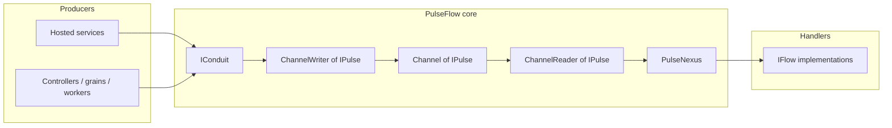

# Runtime model

This page describes how the moving parts connect at runtime after DI registration.

## Component diagram

## Registration order (conceptual)

1. **`Channel<IPulse>`** is registered (via **Frank.Channels.DependencyInjection**).
2. **`IConduit`** → **`Conduit`** uses the channel’s writer.
3. Each **`IFlow`** is registered as a **singleton** (multiple implementations of **`IFlow`** are all resolved together).
4. **`PulseNexus`** is registered as a **hosted service**; it receives **`ChannelReader<IPulse>`** and **`IEnumerable<IFlow>`** (see DI notes in [Dependency injection wiring](dependency-injection-wiring.md)).

## Single consumer, multiple flows

- There is **one** **`PulseNexus`** loop reading **`IPulse`** instances **sequentially** from the channel.
- For **each** pulse, **zero or more** flows run depending on **`CanHandle`**.
- Matching flows run **concurrently** for that pulse.

## See also

- [Dispatch and ordering](dispatch-and-ordering.md)
- [Conduit and channel](../concepts/conduit-and-channel.md)
